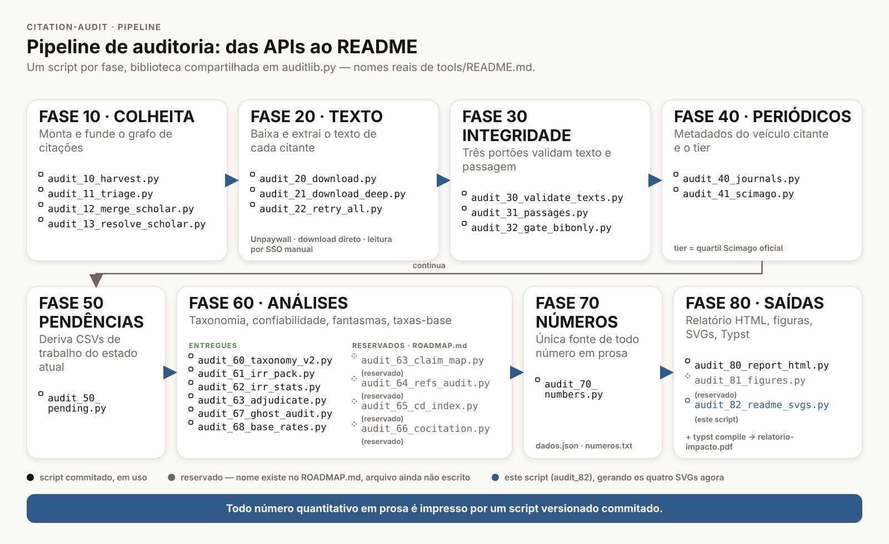
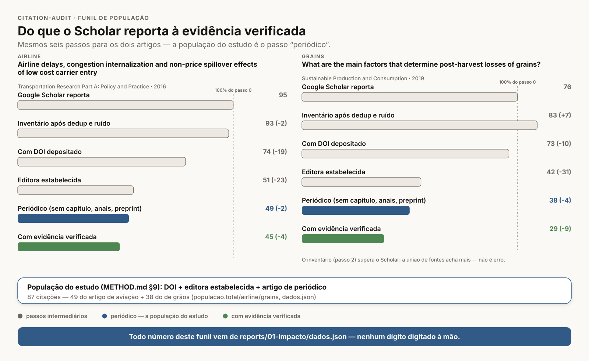
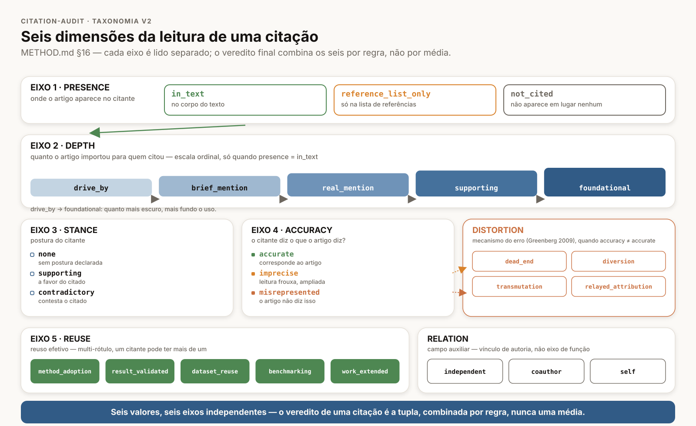
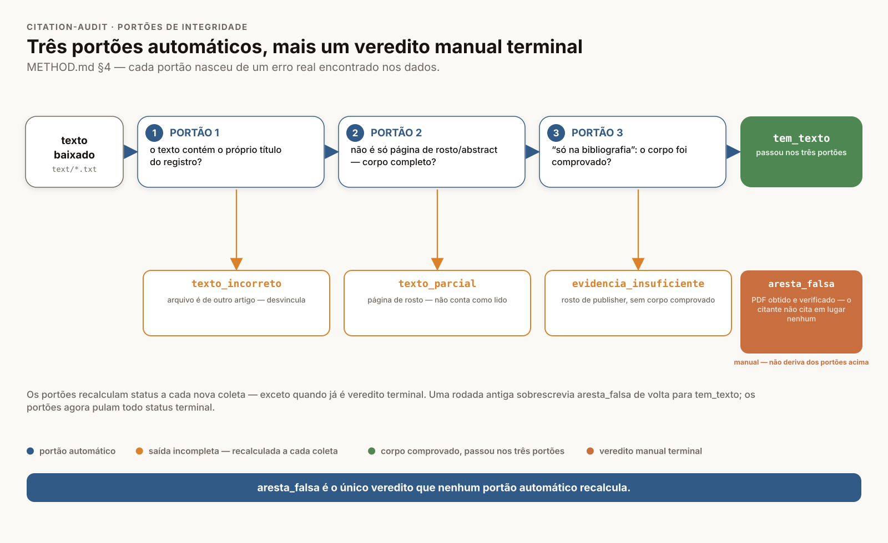

# citation-audit

Auditoria da **qualidade** das citações recebidas por dois artigos: quem usou o
trabalho de verdade, quem citou de passagem, quem citou errado. A pergunta não é
"quantos me citaram", é "quem me usou de verdade".

`MIT` no código · `CC BY-SA 4.0` no texto e nos dados próprios · relatório em
`Typst` · pipeline em `Python 3.12`, só stdlib

O pipeline vai das APIs de citação ao número impresso, com um script por fase e
nenhum dígito digitado à mão.



O funil mostra o que cada critério tira, do que o Google Scholar reporta até a
citação lida com a passagem literal em mãos, artigo por artigo.



Cada citação é lida em eixos separados, e o veredito é a combinação deles,
nunca uma média.



Os portões de integridade existem para separar falta de acesso de achado, e os
três nasceram de erro real encontrado nos dados.



## §1 — O que este repositório mede

O objeto são dois artigos do autor: "Airline delays, congestion internalization
and non-price spillover effects of low cost carrier entry", de 2016, na
*Transportation Research Part A*
([`10.1016/j.tra.2016.01.001`](https://doi.org/10.1016/j.tra.2016.01.001)), e
"What are the main factors that determine post-harvest losses of grains?", de
2019, na *Sustainable Production and Consumption*
([`10.1016/j.spc.2019.09.002`](https://doi.org/10.1016/j.spc.2019.09.002)). As
chaves `airline` e `grains` nomeiam os dois em todo o repositório, e a
definição de cada um vive em [`config.json`](config.json).

A pergunta é uma só: entre quem citou, quem de fato usou o trabalho, e quem
disse sobre ele algo que ele não diz. Contagem de citação não responde isso,
porque trata como iguais a menção em bloco e o artigo que reproduz um método.

Cinco entregas respondem à pergunta:

- **Método auditável.** Uma taxonomia em eixos ortogonais, uma régua de
  evidência e portões de integridade, tudo escrito em [METHOD.md](METHOD.md)
  antes de virar número.
- **Repositório reproduzível.** O grafo de citações, as classificações com a
  passagem literal que as sustenta e o pipeline que deriva tudo isso.
- **Funil e tiers.** Quanto cada critério de população tira, e em que quartil
  Scimago a citação cai.
- **Contribuição real.** O registro de afirmações dos dois artigos cruzado com
  as passagens citantes: qual afirmação foi usada, e se foi usada corretamente.
- **Antes e depois.** Índice CD e co-citação, para dizer se cada artigo
  deslocou ou consolidou a literatura que o antecede.

## §2 — Os achados

Cada número abaixo é impresso por `tools/audit_70_numbers.py`; o ponteiro entre
parênteses diz qual seção de `reports/01-impacto/numeros.txt` o imprime.

- **População.** O estudo tem 87 citações na população, 49 do artigo de aviação
  e 38 do de grãos, e 74 delas chegaram a ter classificação com evidência
  (`audit_70 §populacao`).
- **Cobertura.** Entre os 98 registros com DOI cujo periódico tem quartil
  Scimago oficial, 74 têm trecho literal recuperado, 6 são fantasma verificado,
  1 é aresta falsa e 17 seguem sem evidência (`audit_70 §cobertura`).
- **Presença.** Das 104 citações lidas, 92 mencionam o artigo no corpo do texto
  e 12 constam apenas na lista de referências (`audit_70 §eixos`).
- **Profundidade.** A citação típica é rasa: das 92 menções no corpo, 68 são
  perfunctórias, contra 4 que tomam o artigo como fundacional e 5 que adotam um
  método dele (`audit_70 §eixos`).
- **Exatidão.** Das mesmas 92 menções, 57 são fiéis, 19 são imprecisas e 16
  atribuem ao artigo algo que ele não diz (`audit_70 §eixos`). O mecanismo
  mais comum do erro é `diversion`, com 16 casos, e o repasse creditado ao
  artigo como achado próprio, `relayed_attribution`, responde por 5.
- **Teste cego.** No eixo de exatidão, o κ de Cohen entre os dois codificadores
  cegos é 0,60, contra 0,14 e 0,15 nos pares com o codificador original
  (`audit_70 §irr`). A diferença não é de quem codifica, é de com que
  instrumento: o registro de afirmações é o que torna a exatidão codificável.
- **Afirmações.** O registro extrai 63 afirmações verificáveis dos dois
  artigos, e 35 delas são sustentadas por ao menos uma citação mapeada
  (`audit_70 §alegacoes`).
- **Fantasmas.** A auditoria dedicada reexaminou os 12 registros lidos como
  presentes só na bibliografia: apenas 1 sobrevive com corpo real em disco, e
  11 voltam à condição de corpo indisponível, porque a leitura por acesso
  institucional não foi persistida (`audit_70 §fantasmas`).
- **Taxa-base.** Sob o denominador das menções no corpo, a má atribuição é 16
  em 92, ou 17%, e a citação perfunctória é 68 em 92, ou 74%
  (`audit_70 §taxa-base`). Os comparadores publicados da tabela do relatório
  estão todos com `verification_status: pendente`: valem como orientação, não
  como resultado.

- **Antes e depois.** O índice CD padrão fica em zero nos dois artigos: CD5 de −0,011 em aviação e 0,001 em grãos (`audit_70 §cd`),
  enquanto a variante DI5 lê os dois como deslocadores, 0,600 e 0,306 (`audit_70 §cd`); os dois índices sobre o mesmo grafo
  apontam em direções opostas, e a leitura fica com a variante, não com o artigo. A co-citação das duas vertentes que o
  artigo de aviação declarou conciliar sobe de 0,053 para 0,085 dos documentos entre os períodos 2003–2015 e 2016–2026,
  com Fisher p 0,044 (`audit_70 §cocitacao`), e quem co-cita as duas cita o artigo em 0,292 dos casos, razão de chances
  11,415 contra quem cita uma só (`audit_70 §cocitacao`). Sem contrafactual pareado, é descritivo (METHOD.md).

## §3 — O método em uma tela

**Taxonomia v2, em eixos.** Presença diz onde o artigo aparece no citante;
profundidade, quanto ele importou, numa escala ordinal; postura, de que lado o
citante se pôs; exatidão, se o citante diz o que o artigo diz; reuso, o que ele
de fato tomou emprestado. Quando a exatidão falha, um sub-código nomeia o
mecanismo do erro. Um eixo não implica o outro, e o veredito de uma citação é a
combinação deles. Vocabulário, regras de migração e crosswalk contra os
esquemas publicados estão em [METHOD.md](METHOD.md), seção §16, e em
[`data/taxonomy_v2.json`](data/taxonomy_v2.json).

**Régua de evidência e portões.** Nenhuma classificação sem a passagem literal
do texto citante. Citação sem evidência recuperada fica fora de toda contagem:
não é "ruim", é "não lida". Três portões automáticos protegem essa régua, e o
terceiro é o que mais muda a leitura dos resultados: achar o sobrenome na
bibliografia de uma página de rosto não prova citação-fantasma, prova só que o
corpo não foi obtido.

**Teste cego e colegiado.** O codebook foi testado com três codificadores sobre
um pacote com a identidade do citante apagada. Onde a maioria não fechava, um
colegiado leu o caso com a régua na mão e registrou a justificativa. O desenho
está em [METHOD.md](METHOD.md), seção §17, e os arquivos do pacote em
[`data/irr/README.md`](data/irr/README.md); o que o teste ensinou virou o
codebook v2.1, na seção §18.

**Registro de afirmações.** Cada artigo teve suas afirmações verificáveis
extraídas do PDF publicado, com citação literal e marca de origem: própria ou
repassada de terceiros. É esse registro que separa "o número está no artigo" de
"o número é do artigo", e sem ele a exatidão não é codificável.

**Antes e depois, e taxas-base.** O índice CD e a co-citação medem se cada
artigo deslocou ou consolidou a literatura anterior. As taxas-base põem cada
indicador ao lado do comparador mais próximo da literatura, com denominador
explícito e intervalo de confiança. A revisão que sustenta os dois desenhos
está em [`docs/revisao-literatura.md`](docs/revisao-literatura.md).

## §4 — O relatório

O relatório técnico é [`reports/01-impacto/relatorio-impacto.pdf`](reports/01-impacto/relatorio-impacto.pdf).
Ele é a versão longa deste README: método, funil, cobertura, eixos, anomalias,
taxas-base, limitações e o inventário completo das citações lidas em anexo.

Para compilar, da raiz do repositório (as fontes vendorizadas são obrigatórias;
sem `--font-path` o Typst cai em outra família e a paginação muda):

```bash
typst compile --root . --font-path tools/fonts reports/01-impacto/main.typ reports/01-impacto/relatorio-impacto.pdf
```

A sequência de verificação que roda antes de compilar está em
[`reports/01-impacto/README.md`](reports/01-impacto/README.md).

Há também um painel HTML, gerado por `tools/audit_80_report_html.py` a partir
do mesmo `dados.json`:
[`reports/01-impacto/index.html`](reports/01-impacto/index.html). Esse é o
caminho que vale; o antigo `report/index.html` foi movido para lá.

## §5 — Reproduzir

O bloco offline do pipeline (bloco B de
[`tools/README.md`](tools/README.md#como-rodar)) lê só `data/`, `text/` e
`config.json` locais, não toca a rede, e é seguro rodar quantas vezes quiser:

```bash
python3 tools/audit_12_merge_scholar.py
python3 tools/audit_30_validate_texts.py
python3 tools/audit_31_passages.py
python3 tools/audit_32_gate_bibonly.py
python3 tools/audit_41_scimago.py
python3 tools/audit_50_pending.py
python3 tools/audit_70_numbers.py
python3 tools/audit_80_report_html.py
```

Depois disso, as checagens. Nenhuma escreve: cada uma recomputa em memória e
compara com o que está commitado, saindo com código de erro na diferença.

```bash
python3 tools/check_data.py
python3 tools/audit_70_numbers.py --check
python3 tools/audit_81_figures.py --check
python3 tools/audit_82_readme_svgs.py --check
python3 tools/check_numbers.py --prose reports/01-impacto/main.typ --exempt reports/01-impacto/check_numbers_exempt.txt
```

`check_data.py --local` acrescenta a conferência de cada `text/*.txt` contra o
registro que o referencia; é mais lento, e só vale a pena quando `text/` mudou.

O pipeline é stdlib pura mais `pdftotext` do poppler. As exceções são a fase de
análises, que usa `numpy`, e a das figuras, que precisa do ambiente pinado:

```bash
uv venv --python 3.12 .venv
VIRTUAL_ENV="$PWD/.venv" uv pip install --require-hashes -r requirements.lock
brew install poppler
```

O que **não** está no git, e por quê:

- `text/` e `pdf/` guardam o texto e o PDF completos dos citantes, obtidos para
  leitura e classificação, não para redistribuição (ver
  [`text/README.md`](text/README.md) e [`pdf/README.md`](pdf/README.md)). O
  pipeline os reescreve; o que se publica é a passagem citada, de escopo
  limitado, dentro de `data/classify.json`.
- A planilha do Scimago segue os termos do próprio Scimago e é baixada à mão
  (ver [`data/scimago/README.md`](data/scimago/README.md)).
- `data/cache/` é cache de rede dos scripts de colheita, descartável por
  construção.

## §6 — Estrutura do repositório

```text
tools/               o pipeline, um script por fase; auditlib.py é a biblioteca
                     compartilhada, check_data.py e check_numbers.py só validam
config.json          os dois artigos, as editoras estabelecidas, o Scimago
data/                master.json (o grafo de citações), classify.json (as
                     classificações com a passagem literal), journals.json
                     (periódico e quartil), base_rates.json, ghost_audit.json
data/claims/         o registro de afirmações dos dois artigos
data/irr/            o pacote cego do teste de confiabilidade
data/cd/             referências extraídas dos PDFs, insumo do índice CD
data/cocit/          sementes de co-citação, particionadas por seção
data/derived/        CSVs de trabalho: o que falta e por quê
data/scholar/        as listas completas do Google Scholar, coladas à mão
data/scimago/        só o README: a planilha fica fora do git
docs/                a revisão de literatura e os quatro SVGs deste README
reports/01-impacto/  o relatório Typst: main.typ, dados.json e numeros.txt
                     gerados, figuras/, referencias.bib, o PDF compilado e o
                     painel index.html
text/  pdf/          texto e PDF dos citantes, fora do git (só o README fica)
```

A política de cada arquivo de documentação: [METHOD.md](METHOD.md) fixa
taxonomia, escopo e portões; [CONTRIBUTING.md](CONTRIBUTING.md) tem a régua de
evidência e o setup; [CLAUDE.md](CLAUDE.md) é o manual de operação para agentes
de código; [CHANGELOG.md](CHANGELOG.md) registra o que mudou e
[ROADMAP.md](ROADMAP.md), o que falta.

## §7 — Limitações e pendências

- **As afirmações não foram validadas pelo autor.** O registro foi extraído dos
  PDFs publicados e conferido contra três extrações independentes, mas ninguém
  que escreveu os artigos o revisou. Até que isso aconteça, ele vale como
  leitura de um segundo codificador, não como afirmação confirmada.
- **A codificação é de modelo, não de humano.** As duas frentes de codificação
  humana previstas em [METHOD.md](METHOD.md), seção §17, ainda não rodaram. Sem
  elas, a concordância medida diz que dois modelos com o mesmo codebook
  convergem, o que é menos do que dizer que o codebook é reprodutível por
  qualquer leitor treinado.
- **A cobertura é desigual por editora.** A evidência é densa em Q1 porque a
  Elsevier, que concentra os Q1 das duas áreas, liberou texto completo pelo
  acesso institucional, e rala em Q4 porque Emerald e Wiley não liberaram. Os
  registros sem evidência contados na §2 estão sobretudo nessas duas editoras,
  e nenhuma comparação entre quartis deve ser lida como comparação de qualidade
  de citação por tier.
- **Os corpos lidos por SSO não foram persistidos.** Quase todo veredito de
  citação-fantasma repousa em leitura documentada no navegador, não em arquivo
  em `text/`. Refazer a leitura salvando o corpo é o que torna essa auditoria
  reproduzível.
- **Os comparadores da literatura estão pendentes.** Os valores publicados da
  tabela de taxa-base estão com `verification_status: pendente` em
  `data/base_rates.json` e ainda não foram reconferidos na fonte primária.
- **O estudo depende de bases que estão mudando.** O grafo vem da união de
  quatro APIs gratuitas, e a cobertura de referências do OpenAlex é incompleta
  e não aleatória. A cota diária do OpenAlex zerou no meio da execução e travou
  o antes e depois nesta rodada; o Semantic Scholar passou a ser o segundo
  caminho para a mesma pergunta, e a divergência entre as duas bases é ela
  própria um resultado. Qualquer reexecução pode obter um inventário diferente,
  e é por isso que `data/` é versionado junto com o código que o gera.

## §8 — Como citar

O arquivo [`CITATION.cff`](CITATION.cff) é a fonte canônica, e o GitHub
renderiza a partir dele o botão "Cite this repository". Em APA, resumido:

> Bendinelli, W. E. (2026). *citation-audit: auditoria da qualidade das
> citações recebidas por dois artigos* \[Software\].
> https://github.com/wbendinelli/citation-audit

## §9 — Licenças

**MIT** para o código: `tools/`, `config.json` e `.github/` (ver
[LICENSE](LICENSE)). **CC BY-SA 4.0** para o texto e os dados próprios: este
README, [METHOD.md](METHOD.md), [ROADMAP.md](ROADMAP.md), a prosa do relatório
e as notas de `data/classify.json` (ver
[LICENSE-CC-BY-SA-4.0.md](LICENSE-CC-BY-SA-4.0.md)).

Três ressalvas. As passagens citadas em `data/classify.json` pertencem aos seus
próprios autores: são citação de escopo limitado, não conteúdo deste
repositório relicenciado. Os dados do OpenAlex usados no grafo de citações são
CC0. Os dados do Scimago seguem os termos do próprio Scimago e não são
redistribuídos aqui (ver [`data/scimago/README.md`](data/scimago/README.md)).
